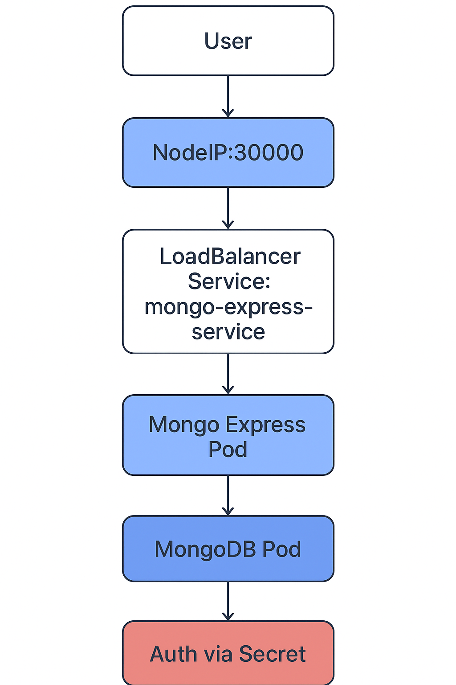

# 🧩 DevOps Project: Deploying MongoDB & Mongo Express in Kubernetes

This project demonstrates how to deploy a **web application (Mongo Express)** and a **database (MongoDB)** on a **Kubernetes cluster**, using best DevOps practices such as **ConfigMaps**, **Secrets**, **Deployments**, and **Services**.

---

## 📋 Project Overview

This setup showcases a classic two-tier application structure:
- **MongoDB** → backend database
- **Mongo Express** → web-based admin interface for MongoDB

🚀 Highlight:

- Deploy applications using Kubernetes manifests (`.yaml` files)
- Configure environment variables securely
- Manage internal and external connectivity between services
- Access applications from a browser

---

## 🏗️ Architecture Diagram

Below is a visual representation of the project workflow:

```
Browser (HTTP Request: NodeIP:30000)
       |
       v
[ External Service (LoadBalancer): mongo-express-service ]
       |
       v
[ Mongo Express Pod (Deployment) ]
   |---> Reads DB URL from ConfigMap
   |---> Reads Credentials from Secret
       |
       v
[ Internal Service (ClusterIP): mongodb-service ]
       |
       v
[ MongoDB Pod (Deployment) ]
```

---

## ⚙️ Components

### 1. MongoDB Deployment
- Creates a MongoDB Pod running the latest official `mongo` image.
- Exposes **port 27017**.
- Credentials (username/password) are not hardcoded but **referenced from a Kubernetes Secret**.

### 2. MongoDB Service (Internal)
- **Type:** `ClusterIP`
- Makes MongoDB accessible only within the cluster.
- Connects to Mongo Express through the service name.

### 3. Secret (`mongodb-secret`)
Stores MongoDB credentials securely.


### 4. ConfigMap (`mongodb-configmap`)
Contains the MongoDB service endpoint for Mongo Express to connect to.


### 5. Mongo Express Deployment
- Uses the `mongo-express` image.
- Exposes **port 8081**.
- Reads database URL from **ConfigMap** and credentials from **Secret**.

### 6. Mongo Express Service (External)
- **Type:** `LoadBalancer`
- Opens **NodePort 30000**, allowing browser access.
- Maps port `8081` (container) → `30000` (external).

---

## 🧠 Request Flow

1. User sends HTTP request → `NodeIP:30000`
2. LoadBalancer service (`mongo-express-service`) forwards request to Mongo Express Pod
3. Mongo Express connects to internal service (`mongodb-service`)
4. Internal service routes request to MongoDB Pod
5. MongoDB authenticates using credentials from Secret

---

## 🧰 Prerequisites

- [Minikube](https://minikube.sigs.k8s.io/docs/start/)
- [kubectl](https://kubernetes.io/docs/tasks/tools/)
- [Docker](https://docs.docker.com/)
- [Visual Studio Code](https://code.visualstudio.com/) (optional for editing YAML files)

---

## 🚀 Deployment Steps

1. **Start your Kubernetes cluster**
   ```bash
   minikube start --driver docker
   ```


2. **Create the Secret**
   ```bash
   kubectl apply -f mongo-secret.yaml
   ```


3. **Create the ConfigMap**
   ```bash
   kubectl apply -f mongo-configmap.yaml
   ```
   

4. **Deploy MongoDB**
   ```bash
   kubectl apply -f mongo.yaml
   ```
   

5. **Deploy Mongo Express**
   ```bash
   kubectl apply -f mongo-express.yaml
   ```
   

6. **Check all resources**
   ```bash
   kubectl get all
   ```


7. **Access the application**
   ```bash
   minikube service mongo-express-service
   ```
   This will open Mongo Express in your default browser.

---

## 🔍 Validation

To verify the setup:
```bash
kubectl logs deployment/mongo-express-deployment
kubectl describe service mongodb-service
```

---

## 🧹 Cleanup

To remove all components:
```bash
kubectl delete -f .
```

---

## 📊 Summary

| Component | Type | Purpose |
|------------|------|----------|
| MongoDB Deployment | Pod | Database backend |
| MongoDB Service | ClusterIP | Internal DB access |
| Mongo Express Deployment | Pod | Web admin for MongoDB |
| Mongo Express Service | LoadBalancer | External access |
| ConfigMap | Key-Value Store | Stores MongoDB URL |
| Secret | Encrypted Data | Stores credentials |

---

## 🖼️ Visual Overview



---

## 🧑‍💻 Author

**Mohamed Eldemerdash**  
DevOps Engineer & Mechanical Engineer
